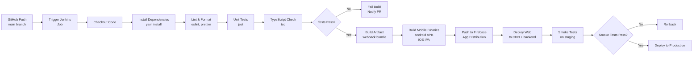

| **GET** | `/bonds` | ❌ | List bonds with filters |
| **GET** | `/bonds/:bondId` | ❌ | Bond detail |
| **POST** | `/orders` | ✅ | Place order |
| **GET** | `/orders` | ✅ | Order list |
| **GET** | `/orders/:orderId` | ✅ | Order detail |
| **GET** | `/portfolio` | ✅ | Holdings |
| **GET** | `/portfolio/cashflows` | ✅ | Coupon & maturity dates |
| **GET** | `/kyc/status` | ✅ | KYC status |
| **POST** | `/kyc/submit` | ✅ | Submit KYC |
| **POST** | `/kyc/upload-document` | ✅ | Upload doc |
| **GET** | `/user-details` | ✅ | Profile |
| **PUT** | `/user-details` | ✅ | Update profile |
| **POST** | `/payment/razorpay-callback` | ⚠️ Webhook | Payment confirmation |
| **POST** | `/webhook/nsdl-settlement` | ⚠️ Webhook | Settlement callback |

---

## 10. How to Extend the System

### 10.1 Adding a New Document Type to KYC

**Step 1: Add Enum**

File: `src/screens/kycV2/enums/KycDocument.type.ts`

```typescript
export enum DocumentType {
  AADHAAR = 'AADHAAR',
  PAN = 'PAN',
  PASSPORT = 'PASSPORT',
  DRIVING_LICENSE = 'DRIVING_LICENSE',
  VOTER_ID = 'VOTER_ID',
  BANK_STATEMENT = 'BANK_STATEMENT',  // NEW
}
```

**Step 2: Add to i18n**

Files: `src/i18n/languages/en.json` and `hi.json`

```json
{
  "KYC": {
    "DOCUMENT_TYPE": {
      "BANK_STATEMENT": "Bank Statement (Last 6 months)"
    }
  }
}
```

**Step 3: Update Validator**

File: `src/validators/validateFileSize.ts` (if doc has specific size constraint)

```typescript
const DOC_SIZE_LIMITS: Record<DocumentType, number> = {
  // ... existing
  [DocumentType.BANK_STATEMENT]: 5 * 1024 * 1024,  // 5MB for bank statement
};
```

**Step 4: Update KYC Step Component**

File: `src/screens/kycV2/steps/address/index.tsx` (or wherever document upload happens)

```typescript
const documentOptions = [
  { label: t('KYC.DOCUMENT_TYPE.AADHAAR'), value: DocumentType.AADHAAR },
  { label: t('KYC.DOCUMENT_TYPE.PASSPORT'), value: DocumentType.PASSPORT },
  // ADD NEW:
  { label: t('KYC.DOCUMENT_TYPE.BANK_STATEMENT'), value: DocumentType.BANK_STATEMENT },
];
```

**Step 5: Backend API Update**

Backend must accept the new doc type in KYC submission endpoint (`POST /kyc/submit`). Confirm with backend team.

### 10.2 Adding a New Async Listener (Kafka equivalent)

Aspero uses queues (likely Bull or Bullmq on Node.js) for async processing, not Kafka.

**Step 1: Define Event**

File: `src/manager/analytics/eventList/kyc.ts` (or create new event file)

```typescript
export const MY_NEW_EVENT = {
  eventName: 'order_settled_notification',
  properties: {
    orderId: 'string',
    status: 'string',
    timestamp: 'number',
  },
};
```

**Step 2: Create Listener Class**

File: `src/molecules/asyncRemoteEventHandler/OrderSettlementListener.ts`

```typescript
import { useEffect } from 'react';
import { EventRegister } from '@src/utils/EventRegister';

export const useOrderSettlementListener = () => {
  useEffect(() => {
    const listener = EventRegister.addEventListener('order_settled', (data) => {
      console.log('Order settled event:', data);
      // Handle settlement completion
      // E.g., update portfolio cache, show notification, etc.
    });

    return () => EventRegister.removeEventListener(listener);
  }, []);
};
```

**Step 3: Emit Event from Backend**

Backend publishes event to event stream (webhook or direct emit). Frontend listens for event via Pusher or WebSocket.

File: `src/molecules/asyncRemoteEventHandler/PusherEventHandler.tsx`

```typescript
import Pusher from 'pusher-js';

export const usePusherListener = () => {
  useEffect(() => {
    const pusher = new Pusher(config.PUSHER_KEY, {
      cluster: config.PUSHER_CLUSTER,
      encrypted: true,
    });

    const channel = pusher.subscribe(`user-${userId}`);
    channel.bind('order_settled', (data) => {
      // Handle settlement
      EventRegister.emit('order_settled', data);
    });

    return () => pusher.unsubscribe();
  }, [userId]);
};
```

**Step 4: Trigger in Component**

```typescript
const MyComponent = () => {
  useOrderSettlementListener();  // Hook listens for event
  // Component renders; when event fires, listener callback runs
};
```

### 10.3 Adding a New Product (e.g., Fixed Deposit)

**Step 1: Create Product Type**

File: `src/constants/product.ts`

```typescript
export enum ProductType {
  BOND = 'BOND',
  FIXED_DEPOSIT = 'FIXED_DEPOSIT',  // NEW
}
```

**Step 2: Create Screen Structure**

```
src/screens/fd/
├─ FD.tsx                    # Main container
├─ components/
│  ├─ FDLandingScreen/
│  └─ FDDetailScreen/
├─ hooks/
│  ├─ useFDList.ts
│  └─ useFDDetail.ts
├─ service/
│  ├─ FD.dataService.ts
│  └─ FD.type.ts
└─ constants/
   └─ FD.constants.ts
```

**Step 3: Add Navigation**

File: `src/navigation/PublicNavigation.tsx`

```typescript
const PublicStack = createNativeStackNavigator();

<PublicStack.Navigator>
  {/* ... existing screens */}
  <PublicStack.Screen name={DashboardScreens.FD} component={FD} />
</PublicStack.Navigator>
```

**Step 4: Add to Home Navigation**

File: `src/navigation/homeTabNavigator/TabNavigation.tsx`

```typescript
const TabNav = createBottomTabNavigator();

<TabNav.Navigator>
  {/* ... existing tabs */}
  <TabNav.Screen
    name={DashboardScreens.FD}
    component={FD}
    options={{ tabBarLabel: t('TAB.FD'), tabBarIcon: FDIcon }}
  />
</TabNav.Navigator>
```

**Step 5: Add API Service**

File: `src/screens/fd/service/FD.dataService.ts`

```typescript
import { apiClient } from '@src/api';
import apiConfig from '@config/apiConfiguration';

export async function getFDList() {
  return apiClient.get({
    url: `${apiConfig.API_BASE_URL}/fd`,
  });
}
```

**Step 6: Add Feature Flag**

Firebase Remote Config: Add flag `ENABLE_FD_PRODUCT` (boolean).

In component:
```typescript
const { ENABLE_FD_PRODUCT } = useRemoteConfig();

if (!ENABLE_FD_PRODUCT) return <FeatureNotAvailable />;
```

**Step 7: Add i18n Keys**

Files: `src/i18n/languages/en.json` and `hi.json`

```json
{
  "FD": {
    "TITLE": "Fixed Deposits",
    "DESCRIPTION": "Earn guaranteed returns"
  }
}
```

### 10.4 Adding a New Mandatory Requirement (Config-Only)

**Scenario:** Issuer requests all orders >₹1L require income proof upload before settlement.

**Step 1: Define Rule in Config**

Backend config table or Firebase Remote Config:

```json
{
  "ORDER_REQUIREMENTS": {
    "INCOME_PROOF_THRESHOLD": 100000,
    "INCOME_PROOF_REQUIRED_FOR_AMOUNTS_ABOVE": true
  }
}
```

**Step 2: Fetch Config in Order Screen**

File: `src/screens/payment/paymentMode/PaymentMode.tsx`

```typescript
const { ORDER_REQUIREMENTS } = useRemoteConfig();

const requiresIncomeProof = amount > ORDER_REQUIREMENTS.INCOME_PROOF_THRESHOLD;

if (requiresIncomeProof) {
  return <IncomeProofUploadScreen />;
}
```

**Step 3: No Code Changes Required**

PM updates the config value; app fetches on restart and enforces new rule. No app release needed.

### 10.5 Changing a User-Facing Message or Rejection Reason

**Step 1: Identify Message Location**

Search codebase:
```bash
yarn find-unused  # Check if string is hardcoded
grep -r "Your KYC is approved" src/  # Find hardcoded string
```

**Step 2: Add/Update i18n Key**

File: `src/i18n/languages/en.json`

```json
{
  "KYC": {
    "SUCCESS_MESSAGE": "Your KYC verification is complete. You can now invest in bonds!"
  }
}
```

**Step 3: Use in Component**

```typescript
import { useTranslation } from 'react-i18next';

const { t } = useTranslation();

<Text>{t('KYC.SUCCESS_MESSAGE')}</Text>
```

**Step 4: Update Hindi Translation**

File: `src/i18n/languages/hi.json`

```json
{
  "KYC": {
    "SUCCESS_MESSAGE": "आपका KYC सत्यापन पूरा हो गया है। अब आप बांड में निवेश कर सकते हैं!"
  }
}
```

No code changes needed for message text updates; just update JSON files and release new build.

### 10.6 Error Handling Pattern

**Step 1: Define Error Code**

File: `src/api/ErrorModel.ts`

```typescript
export enum ErrorCode {
  BOND_OUT_OF_STOCK = 'BOND_OUT_OF_STOCK',
  AMOUNT_EXCEEDS_LIMIT = 'AMOUNT_EXCEEDS_LIMIT',
  KYC_REQUIRED = 'KYC_REQUIRED',
  // ... existing codes
}
```

**Step 2: Throw Error from Service**

```typescript
export async function placeOrder(payload: OrderPayload) {
  try {
    return await apiClient.post({
      url: `${apiConfig.API_BASE_URL}/orders`,
      data: payload,
    });
  } catch (error: any) {
    const errorCode = error.response?.data?.errors?.[0]?.errorCode;
    const errorMessage = error.response?.data?.errors?.[0]?.message;

    throw {
      errorCode,
      errorMessage,
      statusCode: error.response?.status,
    };
  }
}
```

**Step 3: Handle in Component**

```typescript
const { showToast } = useToast();

try {
  const result = await placeOrder(payload);
  showToast('success', { info: t('ORDER.PLACED_SUCCESSFULLY') });
} catch (error: any) {
  const userFriendlyMessage = getErrorMessage(error.errorCode, t);
  showToast('error', { info: userFriendlyMessage });
}

function getErrorMessage(errorCode: string, t: TFunction) {
  const messages: Record<string, string> = {
    [ErrorCode.BOND_OUT_OF_STOCK]: t('ERROR.BOND_OUT_OF_STOCK'),
    [ErrorCode.AMOUNT_EXCEEDS_LIMIT]: t('ERROR.AMOUNT_EXCEEDS_LIMIT'),
    // ... more mappings
  };
  return messages[errorCode] || t('ERROR.GENERIC');
}
```

### 10.7 Adding a New Workflow Step

**Step 1: Create Step Component**

File: `src/screens/kycV2/steps/newStep/NewStep.tsx`

```typescript
import React, { useState } from 'react';
import { View, Text } from 'react-native';
import { useTranslation } from 'react-i18next';
import { Button } from '@b2c-components/core/Button';

interface NewStepProps {
  onNext: (data: any) => void;
  onBack: () => void;
  initialData?: any;
}

export const NewStep: React.FC<NewStepProps> = ({ onNext, onBack, initialData }) => {
  const { t } = useTranslation();
  const [formData, setFormData] = useState(initialData || {});

  const handleSubmit = () => {
    // Validate
    if (!formData.field1) {
      showToast('error', { info: t('ERROR.REQUIRED_FIELD') });
      return;
    }
    onNext(formData);
  };

  return (
    <View>
      <Text>{t('NEW_STEP.TITLE')}</Text>
      {/* Form fields */}
      <Button onPress={handleSubmit} title={t('COMMON.NEXT')} />
      <Button onPress={onBack} title={t('COMMON.BACK')} />
    </View>
  );
};
```

**Step 2: Register Step**

File: `src/screens/kycV2/Kyc.tsx`

```typescript
import { NewStep } from './steps/newStep/NewStep';

const KYC_STEPS = [
  { key: 'PERSONAL_DETAILS', component: PersonalDetails },
  { key: 'PAN', component: PAN },
  // ... existing steps
  { key: 'NEW_STEP', component: NewStep },  // ADD NEW
];
```

**Step 3: Update i18n**

```json
{
  "NEW_STEP": {
    "TITLE": "New Step Title",
    "DESCRIPTION": "Description of what this step collects"
  }
}
```

**Step 4: Update Backend**

Backend KYC submission endpoint must handle new field. Coordinate with backend team.

---

## 11. Data Model & Status Rules

### 11.1 Core Database Tables

| Table | Purpose | Key Indexes |
|-------|---------|------------|
| `users` | User accounts, credentials | `phoneNumber`, `email`, `userId` |
| `kyc_submissions` | KYC data per user | `userId`, `status`, `createdAt` |
| `bonds` | Bond listings | `isin`, `issuer_id`, `status`, `isActive` |
| `orders` | User bond orders | `userId`, `bondId`, `status`, `createdAt` |
| `portfolio` | User holdings | `userId`, `bondId`, `quantity` |
| `payments` | Payment records | `orderId`, `razorpayOrderId`, `status` |
| `demat_accounts` | Linked demat accounts | `userId`, `boAccount`, `primary` |
| `bank_accounts` | Linked bank accounts | `userId`, `accountNumber`, `primary` |
| `watchlist` | User's saved bonds | `userId`, `bondId`, `createdAt` |
| `kyc_documents` | Uploaded KYC docs | `kycId`, `documentType`, `url` |
| `audit_logs` | Compliance audit trail | `userId`, `action`, `timestamp` |

### 11.2 Status Enums

**KYC Status:**
```typescript
enum KycStatus {
  NOT_STARTED = 'NOT_STARTED',
  IN_PROGRESS = 'IN_PROGRESS',
  PENDING_REVIEW = 'PENDING_REVIEW',
  APPROVED = 'APPROVED',
  REJECTED = 'REJECTED',
  BLOCKED = 'BLOCKED',
}
```

**Order Status:**
```typescript
enum OrderStatus {
  PENDING_PAYMENT = 'PENDING_PAYMENT',
  ORDER_PLACED = 'ORDER_PLACED',
  SETTLEMENT_FAILED = 'SETTLEMENT_FAILED',
  SETTLED = 'SETTLED',
  MATURE = 'MATURE',
  CANCELLED = 'CANCELLED',
  ABANDONED = 'ABANDONED',
}
```

**Bond Status:**
```typescript
enum BondStatus {
  ACTIVE = 'ACTIVE',
  CLOSED = 'CLOSED',
  UPCOMING = 'UPCOMING',
  MATURED = 'MATURED',
}
```

### 11.3 Idempotency Pattern

**Problem:** Duplicate order submissions due to network retries.

**Solution:** Idempotency keys stored in DB.

```typescript
// Request includes Idempotency-Key header
POST /orders
Idempotency-Key: UID-{timestamp}-{randomString}
```

**Backend:**
```typescript
// Check if key already processed
const existingOrder = await Order.findOne({ idempotencyKey });
if (existingOrder) {
  return existingOrder;  // Return cached response
}

// Create new order
const order = await Order.create({
  idempotencyKey,
  userId,
  bondId,
  // ...
});

// Store response for future duplicate requests
```

### 11.4 Caching Strategy

| Data | TTL | Eviction | Where |
|------|-----|----------|-------|
| Bond listings | 1 hour | LRU | Redis (backend) + local (mobile/web) |
| User portfolio | 5 minutes | On update | Local state + backend cache |
| User profile | 30 minutes | On update | Local state + backend cache |
| Firebase Remote Config | 12 hours | Fetch on app start | Local storage |
| Watchlist | 1 hour | On add/remove | Local state |
| Authentication tokens | 15 min (access) / 30 days (refresh) | Expiry | Device storage |

**Mobile-specific (AsyncStorage):**
- Last 50 viewed bonds
- Watchlist (local copy)
- User's recently entered form data (for resume)

---

## 12. Integration Map

```
┌─────────────────────────────────────────────────────────────┐
│                      ASPERO APP                             │
├─────────────────────────────────────────────────────────────┤
│                                                             │
│  ┌──────────────────────────────────────────────────┐      │
│  │  AUTHENTICATION & USER MANAGEMENT                │      │
│  ├──────────────────────────────────────────────────┤      │
│  │  Firebase Auth → JWT tokens                      │      │
│  │  Phone/Email OTP validation                      │      │
│  └──────────────────────────────────────────────────┘      │
│         │                                                   │
│         └─→ Firebase ✓                                     │
│             ├─ Authentication module                      │
│             └─ Phone verification APIs                    │
│                                                            │
│  ┌──────────────────────────────────────────────────┐      │
│  │  PAYMENT PROCESSING                              │      │
│  ├──────────────────────────────────────────────────┤      │
│  │  Order submission → Razorpay checkout           │      │
│  │  Payment confirmation → Webhook handling         │      │
│  └──────────────────────────────────────────────────┘      │
│         │                                                   │
│         └─→ Razorpay ✓                                     │
│             ├─ Payment gateway                            │
│             ├─ UPI, Cards, Netbanking                     │
│             └─ Webhook for confirmation                   │
│                                                            │
│  ┌──────────────────────────────────────────────────┐      │
│  │  SECURITIES SETTLEMENT                           │      │
│  ├──────────────────────────────────────────────────┤      │
│  │  Order settlement → NSDL demat account           │      │
│  │  Settlement confirmation → Portfolio update      │      │
│  └──────────────────────────────────────────────────┘      │
│         │                                                   │
│         └─→ NSDL/CDSL ✓                                    │
│             ├─ BO (Beneficial Owner) account mgmt        │
│             ├─ Securities transfer                        │
│             └─ Settlement APIs                            │
│                                                            │
│  ┌──────────────────────────────────────────────────┐      │
│  │  CONTENT & PRICING DATA                          │      │
│  ├──────────────────────────────────────────────────┤      │
│  │  Bond data → CMS fetch                          │      │
│  │  Issuer details → CMS                           │      │
│  │  Real-time pricing → Data provider              │      │
│  └──────────────────────────────────────────────────┘      │
│         │                                                   │
│         └─→ Strapi CMS ✓                                   │
│             ├─ Bond metadata                              │
│             ├─ Issuer profiles                            │
│             └─ Marketing content                          │
│                                                            │
│  ┌──────────────────────────────────────────────────┐      │
│  │  DOCUMENT PROCESSING                             │      │
│  ├──────────────────────────────────────────────────┤      │
│  │  KYC doc upload → OCR extraction                 │      │
│  │  Aadhaar/PAN validation                          │      │
│  └──────────────────────────────────────────────────┘      │
│         │                                                   │
│         └─→ HyperVerge ✓ (OCR/liveness)                   │
│             ├─ Document OCR                               │
│             └─ Facial liveness check                      │
│                                                            │
│  ┌──────────────────────────────────────────────────┐      │
│  │  ANALYTICS & TRACKING                            │      │
│  ├──────────────────────────────────────────────────┤      │
│  │  Event tracking → Multi-service analytics        │      │
│  │  App attribution → AppsFlyer / Branch            │      │
│  └──────────────────────────────────────────────────┘      │
│         │                                                   │
│         ├─→ Firebase Analytics ✓                          │
│         ├─→ Amplitude ✓                                   │
│         ├─→ AppsFlyer ✓                                   │
│         ├─→ Branch ✓                                      │
│         ├─→ WebEngage ✓                                   │
│         └─→ Facebook Pixel ✓ (web)                        │
│                                                            │
│  ┌──────────────────────────────────────────────────┐      │
│  │  NOTIFICATIONS & MESSAGING                       │      │
│  ├──────────────────────────────────────────────────┤      │
│  │  Push notifications → FCM/APNs                   │      │
│  │  Email notifications → Email service             │      │
│  │  SMS notifications → SMS gateway                 │      │
│  │  Real-time updates → WebSocket/Pusher           │      │
│  └──────────────────────────────────────────────────┘      │
│         │                                                   │
│         ├─→ Firebase Cloud Messaging ✓                    │
│         ├─→ Apple Push Notification (APNs) ✓             │
│         ├─→ SendGrid / Email service ✓                    │
│         ├─→ Twilio / SMS gateway ✓                        │
│         └─→ Pusher ✓ (real-time WebSocket)               │
│                                                            │
│  ┌──────────────────────────────────────────────────┐      │
│  │  SUPPORT & HELPDESK                              │      │
│  ├──────────────────────────────────────────────────┤      │
│  │  Ticket creation → Support system                │      │
│  │  Live chat → Chat widget                         │      │
│  └──────────────────────────────────────────────────┘      │
│         │                                                   │
│         ├─→ Freshdesk ✓ (ticketing)                       │
│         └─→ Zoho SalesIQ ✓ (live chat)                    │
│                                                            │
│  ┌──────────────────────────────────────────────────┐      │
│  │  FEATURE CONFIGURATION                           │      │
│  ├──────────────────────────────────────────────────┤      │
│  │  Feature flags → Remote config                   │      │
│  │  A/B testing → Remote config                     │      │
│  └──────────────────────────────────────────────────┘      │
│         │                                                   │
│         └─→ Firebase Remote Config ✓                      │
│             ├─ Feature toggles                            │
│             ├─ Transaction limits                         │
│             └─ UI variations                              │
│                                                            │
└─────────────────────────────────────────────────────────────┘
```

### Integration Details

| System | Purpose | Protocol | Direction | Auth | Failure Handling |
|--------|---------|----------|-----------|------|-----------------|
| **Firebase** | Auth, FCM, Remote Config, Analytics | REST/gRPC | Bidirectional | Service account key | Offline mode; cached config |
| **Razorpay** | Payment processing | REST + Webhook | Bidirectional | API key (basic auth) | Webhook retry; order status poll |
| **NSDL** | Securities settlement | REST + Webhook | Bidirectional | API key | Retry queue; manual intervention |
| **Strapi CMS** | Bond/issuer data | REST | One-way pull | Bearer token | Cache fallback; stale data acceptable |
| **HyperVerge** | OCR, liveness | REST | One-way (upload) | API key | Manual review; user retry |
| **AppsFlyer** | App attribution | REST + Webhook | Bidirectional | App token | Non-critical; logging only |
| **Branch** | Deep linking | SDK + REST | Bidirectional | Branch key | Fallback to custom scheme |
| **Pusher** | Real-time updates | WebSocket | Bidirectional | App key | Fallback to polling |
| **Freshdesk** | Support tickets | REST | One-way push | API key | Async queue; retry |
| **Amplitude** | Analytics | REST (batch) | One-way push | API key | Non-critical; batched |

---

## 13. Operational Runbook

### 13.1 Common Failure Modes

| Symptom | Likely Cause | Resolution |
|---------|--------------|-----------|
| Users see "Payment failed" but money was deducted | Razorpay payment succeeded; webhook not received | Check Razorpay webhook logs; manually verify payment status and update order |
| Users stuck on "Settlement pending" for >24 hrs | NSDL settlement API timeout or BO account issue | Check NSDL response logs; verify BO account is active; manual settlement retry |
| KYC approvals stuck in "Pending Review" | Manual review queue backlog or service error | Check KYC review queue; escalate to compliance team if >48 hrs |
| App crashes on bond detail page | Memory leak or large image load | Clear local cache; check Image preloader; reduce image size in CMS |
| Push notifications not arriving | Firebase token invalid or expired | Clear app cache and re-register for FCM; check Firebase project config |
| Bond prices not updating | CMS fetch timeout or network error | Check CMS health; verify CDN connection; fallback to cached price |
| Orders not appearing in portfolio | Portfolio cache not invalidated after settlement | Force portfolio refresh; check settlement webhook handler |

### 13.2 Manual Intervention Steps

**Scenario: User's order stuck in PENDING_PAYMENT after 30 min**

1. Check Razorpay dashboard: Is payment actually confirmed?
   - If YES → Update order status to `ORDER_PLACED` + trigger settlement.
   - If NO → Contact user to retry payment.

2. Verify order record:
   ```sql
   SELECT * FROM orders WHERE orderId = 'ORD-123456';
   ```

3. If payment confirmed, manually trigger settlement:
   ```bash
   curl -X POST http://backend:3000/admin/orders/ORD-123456/settle \
     -H "Authorization: Bearer {admin_token}" \
     -H "Content-Type: application/json"
   ```

**Scenario: User flagged for AML, wants to appeal**

1. Review AML reason in `kyc_submissions` table.
2. Check if user is on debarred list or similar.
3. If false positive → Unblock in DB + re-approve KYC.
4. Notify user via email/in-app message.

### 13.3 Monitoring & Observability

**Key Metrics to Track:**

- KYC approval rate (target >95%).
- Order settlement success rate (target >98%).
- Payment failure rate (target <2%).
- API response time (p95 <500ms).
- NSDL settlement latency (typical T+1, flag if >T+3).

**Dashboards:**

- **Kfuse / Datadog:** API latency, error rates, service health.
- **Firebase Console:** User engagement, crash analytics.
- **Razorpay Dashboard:** Payment metrics, failed transaction details.
- **Custom Admin Panel:** KYC approval queue, settlement status, order backlog.

---

## 14. Testing, Deployment & Infrastructure

### 14.1 Local Test Execution

```bash
# Run all tests
yarn test

# Run single test file
NODE_OPTIONS=--experimental-vm-modules jest --config=jest.config.cjs src/hooks/__tests__/useAuth.test.ts

# Run with coverage
yarn coverage

# Watch mode
yarn test:watch

# Open coverage report
yarn open:coverage
```

### 14.2 Test Pattern Example

File: `src/hooks/__tests__/useAuth.test.ts`

```typescript
import { renderHook, act } from '@testing-library/react-native';
import { useAuth } from '@src/hooks/useAuth';

describe('useAuth hook', () => {
  it('should initialize with logged-out state', () => {
    const { result } = renderHook(() => useAuth());
    expect(result.current.isLoggedIn).toBe(false);
    expect(result.current.token).toBeNull();
  });

  it('should login user with phone and OTP', async () => {
    const { result } = renderHook(() => useAuth());

    await act(async () => {
      await result.current.login('+919876543210');
    });

    await act(async () => {
      await result.current.verifyOtp('123456');
    });

    expect(result.current.isLoggedIn).toBe(true);
    expect(result.current.token).toBeDefined();
  });

  it('should logout user', async () => {
    // Arrange: logged-in state
    const { result } = renderHook(() => useAuth());
    // ... setup login ...

    // Act
    await act(async () => {
      await result.current.logout();
    });

    // Assert
    expect(result.current.isLoggedIn).toBe(false);
    expect(result.current.token).toBeNull();
  });
});
```

### 14.3 Environment Matrix

| Env | Replicas | Resources | Purpose | Data | User Access |
|-----|----------|-----------|---------|------|------------|
| **Development** | 1 | 1 vCPU, 2GB RAM | Local / CI testing | Test/mock data | Developers |
| **QA** | 2 | 2 vCPU, 4GB RAM | Integration testing, early features | Staging-like; clean data | QA team + beta users |
| **UAT** | 3 | 2 vCPU, 4GB RAM | User acceptance, mirrors prod | Real issuer data, test accounts | Internal PMs, select users |
| **Production** | 5+ (auto-scale) | 4 vCPU, 8GB RAM | Live users | Live data, real NSDL settlement | All users |

### 14.4 CI/CD Pipeline (Jenkins)



### 14.5 Deployment Checklist

Before shipping to production:

- [ ] All unit tests pass locally and on CI.
- [ ] TypeScript strict check passes (`yarn typecheck:strict`).
- [ ] No ESLint warnings or errors.
- [ ] API endpoints tested with Postman / curl.
- [ ] KYC flow tested end-to-end (all steps, all rejection scenarios).
- [ ] Order placement tested with real Razorpay sandbox.
- [ ] Settlement flow tested (mock NSDL or UAT NSDL instance).
- [ ] Deep linking tested (Branch, AppFlyer, custom scheme).
- [ ] Push notifications tested on both iOS and Android.
- [ ] Offline scenarios tested (no network, stale cache).
- [ ] Dark mode tested (if enabled).
- [ ] i18n strings verified (no missing keys).
- [ ] Performance profiled (no N+1 queries, image loading optimized).
- [ ] Security checklist: no hardcoded secrets, SSL pinning enabled, auth tokens secure.
- [ ] Release notes prepared.
- [ ] Monitoring dashboards verified (Kfuse, Datadog, Firebase).

### 14.6 Known Gaps & Improvement Areas

| Gap | Impact | Owner | Status |
|-----|--------|-------|--------|
| **Biometric authentication** | Medium (UX improvement) | Mobile team | In progress (branch: enable-biometrics) |
| **Offline transaction queueing** | Low (rare scenario) | TBD | Not started |
| **Dark mode** | Low (aesthetic) | Frontend team | Planned |
| **FD (Fixed Deposit) product** | High (new revenue stream) | Product team | In development |
| **Advanced search / filtering (web)** | Medium (discovery improvement) | Web team | Planned for Q2 2024 |
| **Tax reporting (download ITR, cap gains)** | Medium (compliance feature) | Backend team | Q3 2024 |
| **Advisor integration / robo-advisor** | Low (future upsell) | Strategy team | Post-launch |

### 14.7 Known Developer Gotchas

| Gotcha | Explanation | Workaround |
|--------|------------|-----------|
| **Theme tokens in hardcoded colors** | If you hardcode `#FFFFFF` instead of using `lightThemeV2.semantic.colors.backgroundColors.bg1`, dark mode won't work. | Always check PortfolioStarterCard.style.ts for pattern; search for theme token names in codebase before inventing new colors. |
| **Transient params get cleared on refresh** | Deep links with transient (non-serializable) params lost if user refreshes page. | Use transient registry (`getTransientParams`) for one-time route params; pass serializable data in URL search params. |
| **Firebase Remote Config cached for 12 hours** | Changes to feature flags don't apply until app restart or 12-hour cache expiry. | For urgent changes, manually clear cache or force refresh via API. |
| **Metro cache out of sync** | Code changes don't appear in app; old bundle cached. | Run `watchman watch-del-all` or `yarn start --reset-cache`. |
| **iOS and Android use different font weight rendering** | Android requires full font name (e.g., `SofiaPro-Medium`); iOS uses numeric weight. | Use `getFontFamilyStyle()` helper which handles both. |
| **Async Analytics events in background** | If you emit analytics events and immediately navigate away, event may not send. | Await analytics call or use `setImmediate()` before navigation. |
| **Deep linking doesn't work with stale transient registry** | User manually copies deep link URL, pastes into browser after page refresh; transient data gone. | Always provide fallback route for missing transient data (e.g., redirect to /home). |
| **Watchlist cache out of sync** | User adds bond to watchlist; UI updates but portfolio screen doesn't reflect new watchlist size. | Invalidate watchlist cache after add/remove operation. |
| **i18n keys case-sensitive** | Typo in `t()` call (e.g., `t('ONBOARDING')` vs `t('onboarding')`) silently returns key as fallback. | Use TypeScript strict mode or linter to catch i18n key mismatches. |
| **Order ID format varies by env** | Order IDs on QA are `ORD-QA-123`; on prod are `ORD-GA-123`. String comparisons fail. | Always use order status, not ID string matching, for comparison logic. |

---

# End of Master Context Document

**Last Updated:** 2026-04-10  
**Version:** 1.0  
**Author:** Claude Code  
**Approvals:** TBD